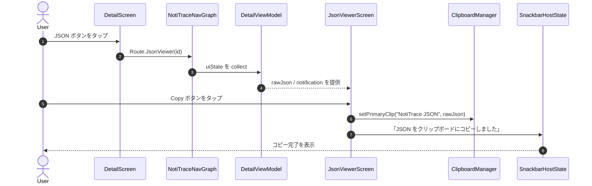
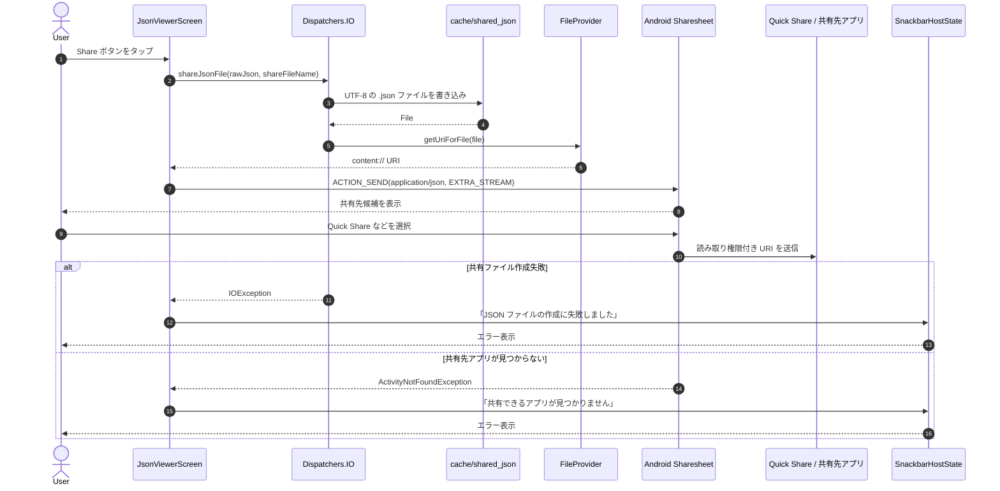

# シーケンス図: JSON ビューア操作フロー

> 対象機能: F-13 JSON 生データ表示  
> 参照: [BASIC_DESIGN.md §3.3.7 JSON ビューア画面](./BASIC_DESIGN.md#337-json-ビューア画面)  
> 最終更新: 2026-05-31

---

## 1. Copy フロー

---

## 2. Share フロー

---

## 3. 設計上の留意点

| 項目 | 詳細 |
|---|---|
| 共有形式 | プレーンテキスト共有ではなく `.json` ファイル共有 |
| 一時保存先 | `cache/shared_json/` 配下。永続保存はしない |
| 公開方式 | `androidx.core.content.FileProvider` による一時 URI 共有 |
| MIME type | `application/json` |
| ファイル名 | `notitrace_<package>_<id>_<lastReceivedAt>.json` |
