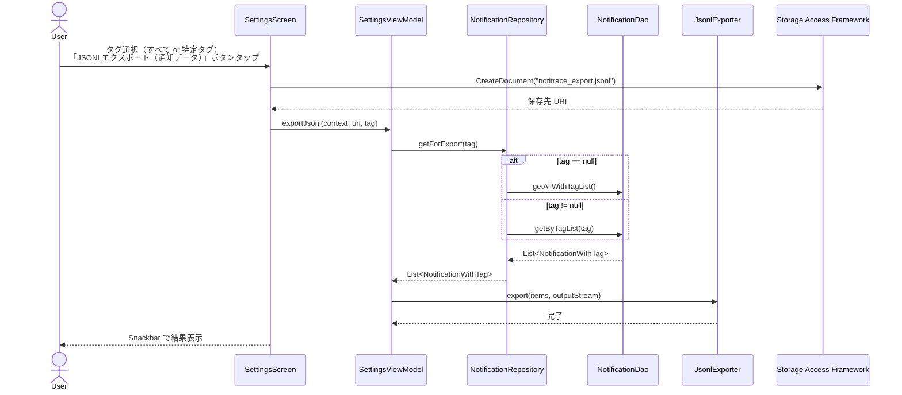
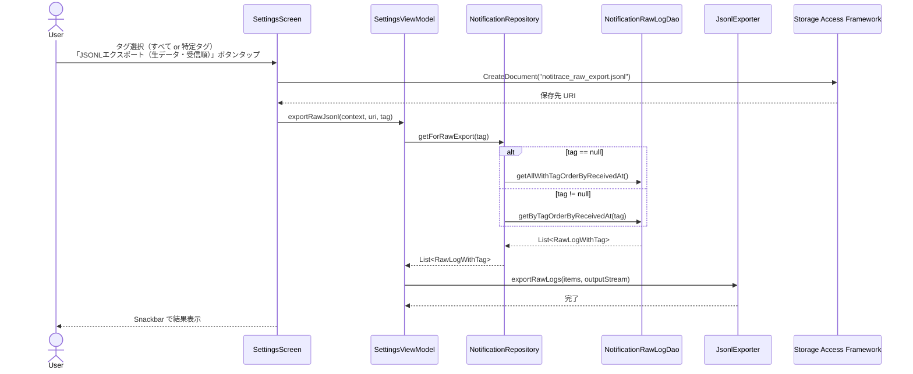

# シーケンス図: JSONL エクスポートフロー

> **対象機能**: F-15 JSONL エクスポート（通知データ） / F-16 JSONL 生データエクスポート（受信順）  
> **最終更新**: 2026-05-01

---

## 1. 通知データエクスポートフロー（F-15）

---

## 2. 生データエクスポートフロー（F-16）

---

## 3. JSONL 出力フォーマット

### 3.1 通知データエクスポート（F-15）

- ファイル拡張子: `.jsonl`
- エンコーディング: UTF-8
- 改行コード: LF (`\n`)
- 1 行 = 1 通知レコード
- `extras_json` / `raw_json` は含めない

| フィールド | 型 | 説明 |
|---|---|---|
| `id` | Long | DB 主キー（端末ローカル値） |
| `packageName` | String | 通知発行元パッケージ名 |
| `title` | String? | 通知タイトル |
| `text` | String? | 通知本文 |
| `bigText` | String? | 拡張テキスト |
| `subText` | String? | サブテキスト |
| `ticker` | String? | ティッカーテキスト |
| `tag` | String? | アプリに付与されたタグ |
| `appLabel` | String? | アプリ表示名 |
| `notificationType` | String | 通知種別コード |
| `receiveCount` | Int | 現行保存モデルでは通常 1 |
| `firstReceivedAt` | Long | 受信時刻 |
| `lastReceivedAt` | Long | 受信時刻 |

### 3.2 生データエクスポート（F-16）

- ファイル拡張子: `.jsonl`
- エンコーディング: UTF-8
- 改行コード: LF (`\n`)
- 1 行 = 1 受信
- 出力順: 受信時刻昇順（ASC）

| フィールド | 型 | 説明 |
|---|---|---|
| `rawJson` | String | `StatusBarNotification` から直接ダンプした生データ JSON |
| `receivedAt` | Long | 受信時刻 |
| `packageName` | String | 通知発行元パッケージ名 |
| `notificationType` | String | 通知種別コード |
| `tag` | String? | アプリに付与されたタグ |
| `appLabel` | String? | アプリ表示名 |

---

## 4. 設計上の留意点

| 項目 | 詳細 |
|---|---|
| 通知データ JSONL | 本文やメタデータを扱いやすい形で出力する |
| 生データ JSONL | `rawJson` を含み、デバッグ・時系列分析に向く |
| SAF 経由 | どちらのエクスポートも Storage Access Framework を使う |
| 暗号化なし | JSONL はプレーンテキスト。機密保全には暗号化バックアップを使う |
