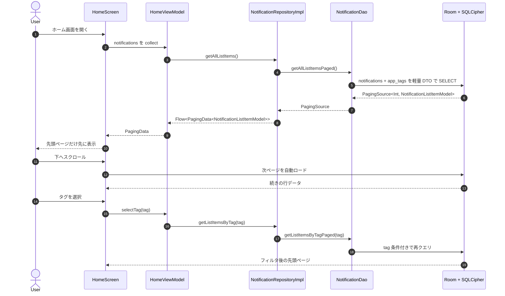
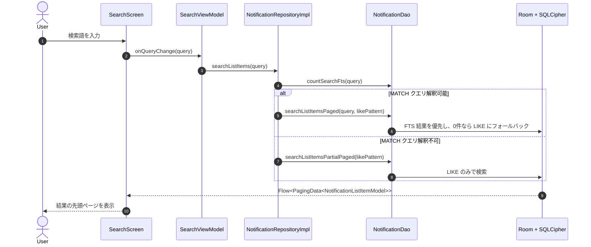

# シーケンス図: 通知一覧・検索表示フロー

> 対象機能: F-03 通知一覧表示 / F-05 全文検索  
> 参照: [BASIC_DESIGN.md §3.3.2 ホーム画面](./BASIC_DESIGN.md#332-ホーム画面) / [BASIC_DESIGN.md §3.3.4 検索画面](./BASIC_DESIGN.md#334-検索画面) / [BASIC_DESIGN.md §6.3 主要クエリ設計](./BASIC_DESIGN.md#63-主要クエリ設計)

---

## 1. ホーム一覧表示

---

## 2. 検索表示

---

## 3. 設計上のポイント

| 項目 | 内容 |
|---|---|
| 一覧 DTO | `NotificationListItemModel` で一覧に不要な `raw_json` / `extras_json` を読まない |
| ソート基準 | `notifications.last_received_at DESC, notifications.id DESC` |
| タグ反映 | `app_tags` を JOIN して読むため、タグ変更は過去ログにも即時反映 |
| Paging | 初回表示は先頭ページのみ取得し、スクロール時に追加ページを読む |
| 検索互換性 | FTS 優先 + 0件/解釈不可時 LIKE フォールバックを維持 |
