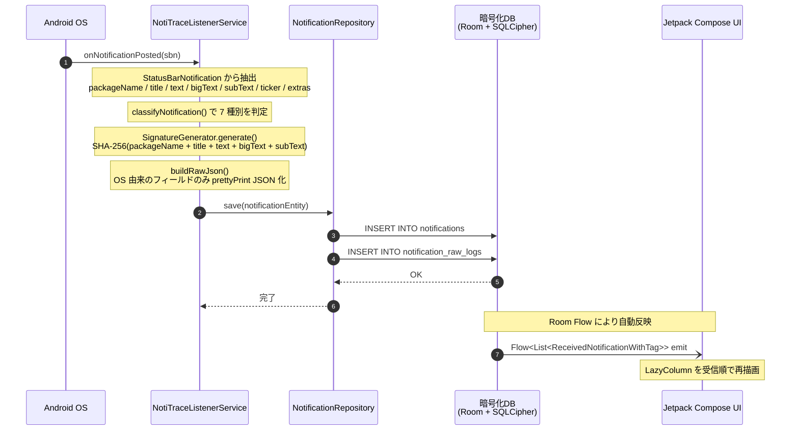

# シーケンス図: 通知受信〜保存フロー

> 対象機能: F-01 通知キャプチャ / F-02 通知シグネチャ生成 / F-12 通知種別分類  
> 参照: [BASIC_DESIGN.md §4.2 通知キャプチャの詳細フロー](./BASIC_DESIGN.md#42-通知キャプチャの詳細フロー) / [BASIC_DESIGN.md §4.4 通知種別分類ロジック](./BASIC_DESIGN.md#44-通知種別分類ロジックf-12)

---

## 1. テキスト形式シーケンス図

```text
Android OS          ListenerService         Repository            暗号化DB              UI
    │                     │                     │                     │                  │
    │ onNotificationPosted(sbn)                 │                     │                  │
    │────────────────────▶│                     │                     │                  │
    │                     │ 抽出: packageName / title / text /        │                  │
    │                     │       bigText / subText / ticker / extras │                  │
    │                     │ classifyNotification()                    │                  │
    │                     │ SignatureGenerator.generate()             │                  │
    │                     │ buildRawJson()                            │                  │
    │                     │ save(entity)                              │                  │
    │                     │────────────────────▶│                     │                  │
    │                     │                     │ INSERT notifications │                  │
    │                     │                     │────────────────────▶│                  │
    │                     │                     │ INSERT raw_logs      │                  │
    │                     │                     │────────────────────▶│                  │
    │                     │                     │         OK          │                  │
    │                     │◀────────────────────│                     │                  │
    │                     │                     │                     │ Flow<List> emit  │
    │                     │                     │                     │─────────────────▶│
    │                     │                     │                     │ 受信順で再描画    │
```

---

## 2. Mermaid 形式シーケンス図



---

## 3. 処理ステップ一覧

| # | 発信元 | 受信先 | 処理内容 | 備考 |
|---|---|---|---|---|
| 1 | Android OS | ListenerService | `onNotificationPosted(sbn)` | システムが通知を配信 |
| 2 | ListenerService | 内部処理 | `StatusBarNotification` から各フィールドを抽出 | `extras` を含む |
| 3 | ListenerService | 内部処理 | `NotificationExtractor.classifyNotification()` | 7 種別を判定 |
| 4 | ListenerService | 内部処理 | `SignatureGenerator.generate()` | 通知相関用 SHA-256 を生成 |
| 5 | ListenerService | 内部処理 | `NotificationExtractor.buildRawJson()` | OS 由来の生データを整形 JSON 化 |
| 6 | ListenerService | Repository | `save(entity)` | Dispatchers.IO コルーチンで実行 |
| 7 | Repository | 暗号化DB | `INSERT INTO notifications` | 重複内容でも毎回新規行を保存 |
| 8 | Repository | 暗号化DB | `INSERT INTO notification_raw_logs` | 受信ごとの rawJson を記録 |
| 9 | 暗号化DB | UI | `Flow<List<ReceivedNotificationWithTag>>` emit | 一覧は受信順で再描画 |
