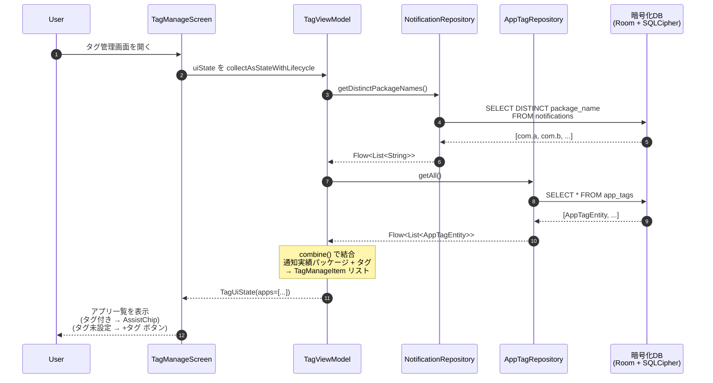
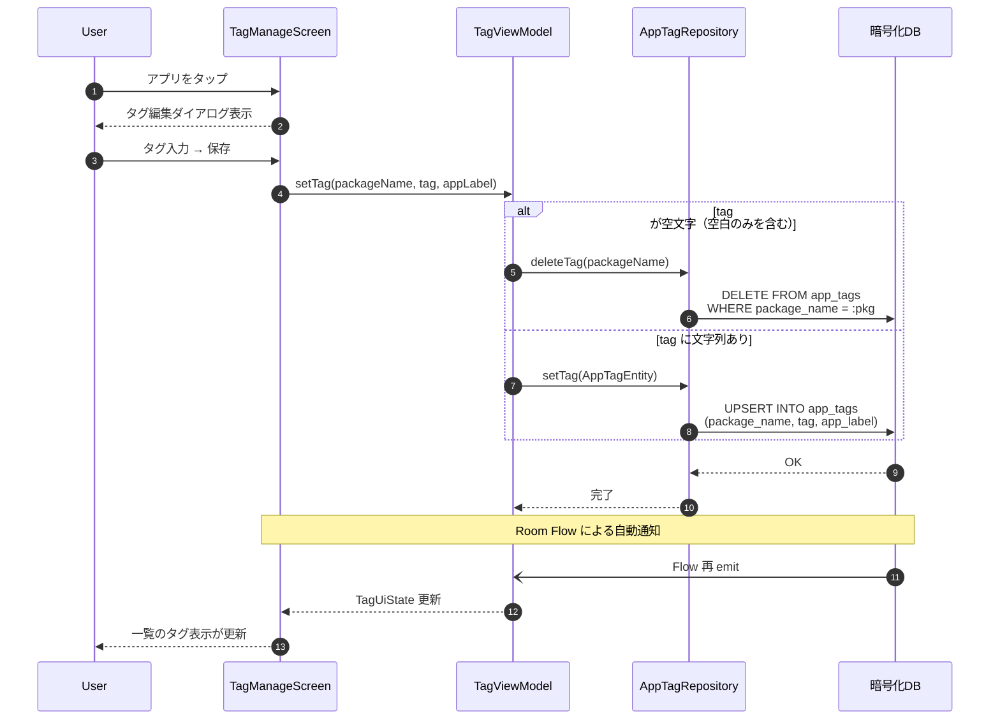

# シーケンス図: タグ管理フロー

> 対象機能: F-06 タグ管理  
> 参照: [BASIC_DESIGN.md §3.3.5 タグ管理画面](./BASIC_DESIGN.md#335-タグ管理画面)

---

## 1. テキスト形式シーケンス図

### 1.1 タグ管理画面の初期表示

```
User                    TagManageScreen        TagViewModel           NotificationRepo       AppTagRepo             暗号化DB
  │                          │                     │                      │                      │                      │
  │  タグ管理画面を開く       │                     │                      │                      │                      │
  │─────────────────────────▶│                     │                      │                      │                      │
  │                          │  uiState を collect  │                      │                      │                      │
  │                          │────────────────────▶│                      │                      │                      │
  │                          │                     │                      │                      │                      │
  │                          │                     │ getDistinctPkgNames()│                      │                      │
  │                          │                     │─────────────────────▶│                      │                      │
  │                          │                     │                      │  SELECT DISTINCT     │                      │
  │                          │                     │                      │  package_name        │                      │
  │                          │                     │                      │  FROM notifications  │                      │
  │                          │                     │                      │─────────────────────────────────────────────▶│
  │                          │                     │                      │                      │                      │
  │                          │                     │                      │  [com.a, com.b, ...] │                      │
  │                          │                     │                      │◀─────────────────────────────────────────────│
  │                          │                     │◀─────────────────────│                      │                      │
  │                          │                     │                      │                      │                      │
  │                          │                     │ getAll()             │                      │                      │
  │                          │                     │──────────────────────────────────────────────▶                      │
  │                          │                     │                      │                      │  SELECT * FROM       │
  │                          │                     │                      │                      │  app_tags            │
  │                          │                     │                      │                      │─────────────────────▶│
  │                          │                     │                      │                      │                      │
  │                          │                     │                      │                      │  [AppTagEntity, ...] │
  │                          │                     │                      │                      │◀─────────────────────│
  │                          │                     │◀──────────────────────────────────────────────                      │
  │                          │                     │                      │                      │                      │
  │                          │                     │ combine() →          │                      │                      │
  │                          │                     │ TagManageItem リスト  │                      │                      │
  │                          │                     │ (通知実績 + タグ結合)  │                      │                      │
  │                          │                     │                      │                      │                      │
  │                          │  TagUiState emit    │                      │                      │                      │
  │                          │◀────────────────────│                      │                      │                      │
  │                          │                     │                      │                      │                      │
  │  アプリ一覧表示           │                     │                      │                      │                      │
  │  (タグ付き/未設定を区別)  │                     │                      │                      │                      │
  │◀─────────────────────────│                     │                      │                      │                      │
```

### 1.2 タグの追加・編集

```
User                    TagManageScreen        TagViewModel           AppTagRepo             暗号化DB
  │                          │                     │                      │                      │
  │  アプリをタップ           │                     │                      │                      │
  │  (チップ or +タグ ボタン) │                     │                      │                      │
  │─────────────────────────▶│                     │                      │                      │
  │                          │                     │                      │                      │
  │  タグ編集ダイアログ表示   │                     │                      │                      │
  │◀─────────────────────────│                     │                      │                      │
  │                          │                     │                      │                      │
  │  タグを入力 → 保存タップ  │                     │                      │                      │
  │─────────────────────────▶│                     │                      │                      │
  │                          │  setTag(pkg, tag)   │                      │                      │
  │                          │────────────────────▶│                      │                      │
  │                          │                     │                      │                      │
  │                          │                     │  [tag が空文字?]      │                      │
  │                          │                     │  ├─ Yes → deleteTag()│                      │
  │                          │                     │  └─ No  → setTag()  │                      │
  │                          │                     │─────────────────────▶│                      │
  │                          │                     │                      │  UPSERT app_tags     │
  │                          │                     │                      │  (package, tag, label)│
  │                          │                     │                      │─────────────────────▶│
  │                          │                     │                      │         OK           │
  │                          │                     │                      │◀─────────────────────│
  │                          │                     │◀─────────────────────│                      │
  │                          │                     │                      │                      │
  │                          │                     │ Flow 再 emit         │                      │
  │                          │  TagUiState 更新     │                      │                      │
  │                          │◀────────────────────│                      │                      │
  │                          │                     │                      │                      │
  │  一覧のタグ表示が更新     │                     │                      │                      │
  │◀─────────────────────────│                     │                      │                      │
```

---

## 2. Mermaid 形式シーケンス図

### 2.1 タグ管理画面の初期表示



### 2.2 タグの追加・編集・削除



---

## 3. 処理ステップ一覧

| # | 発信元 | 受信先 | 処理内容 | 備考 |
|---|---|---|---|---|
| 1 | User | TagManageScreen | タグ管理画面を開く | ホーム画面の TopAppBar タグアイコンから遷移 |
| 2 | TagManageScreen | TagViewModel | `uiState` を `collectAsStateWithLifecycle` で購読 | Compose の再コンポジションで自動更新 |
| 3 | TagViewModel | NotificationRepository | `getDistinctPackageNames()` | 通知実績のある全パッケージ名を取得 |
| 4 | TagViewModel | AppTagRepository | `getAll()` | 既存タグ付きアプリ一覧を取得 |
| 5 | TagViewModel | (内部処理) | `combine()` で結合 | 通知実績パッケージ + タグのみパッケージを統合し、`TagManageItem` リストを生成 |
| 6 | User | TagManageScreen | アプリ行をタップ | タグ付き → 編集ダイアログ、タグなし → 追加ダイアログ |
| 7 | User | TagManageScreen | タグを入力し保存 | 空文字の場合はタグ削除として処理 |
| 8 | TagViewModel | AppTagRepository | `setTag()` or `deleteTag()` | `@Upsert` or `DELETE` |
| 9 | 暗号化DB | TagViewModel | Room Flow 再 emit | invalidation tracker が変更を検知し自動発火 |
| 10 | TagManageScreen | User | 一覧の表示が即時更新 | Compose 再コンポジション |

